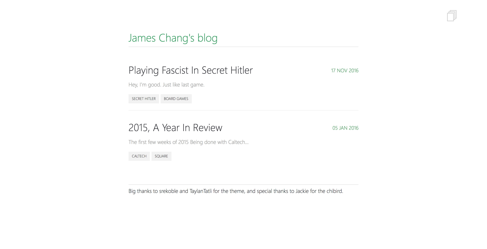

# [longboardcat.github.io](https://longboardcat.github.io/)

## Development

    rvm install 2.4.0
    script/run

Edit posts in `_posts/`. View the site at `localhost:4000`.

## Deployment

Changes pushed to master are deployed on Github Pages.

## Forking

1. Rename the repo to `<github-username>.github.io`.
2. Setup Github pages to watch the `master` branch.
3. Delete all files in `_posts` and start writing!
